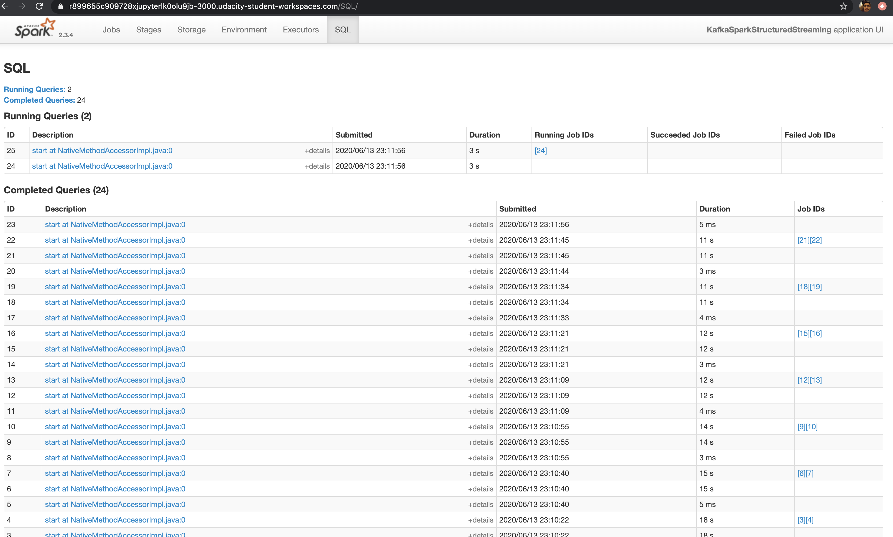

# SF Crimes Spark Project 

## Project requirments
This project requires following python packages:
* findspark
* pyspark
* python-dateutil
* pathlib
	
	Install above requirements if you are using conda, then use "./start.sh" otherwise for "pip use pip install -r requirements.txt"
	
Assumption : Kafka is already installed. The following steps to start kafka if it's installed locally.

### Start Zookeeper
```
bin/zookeeper-server-start.sh config/zookeeper.properties
```
### Start Kafka
```
bin/kafka-server-start.sh config/server.properties
```

#### Step 1: Produce messages to kafka broker 

- start the bootstrap server using this Python command: .python producer_server.py
- Verify data produce correctly with following command
```
  bin/kafka-console-consumer.sh --bootstrap-server localhost:9092 --topic com.udacity.calls --from-beginning
```
Output should look like:


- Verify data with 	"consumer_server.py". 
```
 python consumner_server.py
```
Output should look like:


#### Step 2: Process Kafka messages with Spark structured streaming 'data_stream.py'

 ```
  spark-submit --packages org.apache.spark:spark-sql-kafka-0-10_2.11:2.3.4 --master local[*] data_stream.py
 
 ```
  Spark UI should look like :
   

### Step 3: Answers to the questions:
1. How did changing values on the SparkSession property parameters affect the throughput and latency of the data?
	 the following properties commenly use to affect throughput and latency
	 
	 spark.executor.memory : spark executor memory 
	 
	 spark.executor.cores : No of cores assign to executor. Each task is assign to core. No of task= No of cores.
	 
	 spark.driver.memory : Spark driver memory. this is used during collect() spark actions.
		
  
2. What were the 2-3 most efficient SparkSession property key/value pairs? Through testing multiple variations on values, how can you tell these were the most optimal?

spark.default.parallelism : 2, This is set to match number of kafka partitions, by setting this value the number of consumners in the consumner group fetch data from each partitions independently.

master: Local[\*] : this will allow spark to use all cores for executors in local machine.Set this value to low if you don't want spark to use all cores in your local machine 


